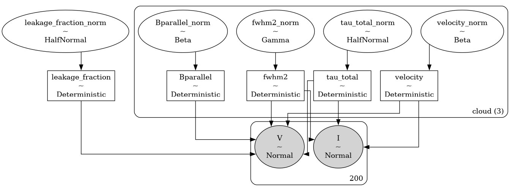

# `bayes_hi_zeeman` <!-- omit in toc -->

A Bayesian Model of 21-cm Zeeman Spectroscopy

`bayes_hi_zeeman` is a Bayesian model of 21-cm Zeeman spectroscopy written in the [`bayes_spec`](https://github.com/tvwenger/bayes_spec) spectral line modeling framework.

- [Installation](#installation)
- [Models](#models)
  - [`AbsorptionModel`](#absorptionmodel)
- [Syntax \& Examples](#syntax--examples)
- [Issues and Contributing](#issues-and-contributing)
- [License and Copyright](#license-and-copyright)

# Installation

Install with `pip` in a `conda` virtual environment:
```
conda create --name bayes_zeeman_hi -c conda-forge pymc cxx-compiler pip
conda activate bayes_zeeman_hi
# Due to a bug in arviz, this fork is temporarily necessary
# See: https://github.com/arviz-devs/arviz/issues/2437
pip install git+https://github.com/tvwenger/arviz.git@plot_pair_reference_labels
# clone this repository via git clone, etc.
cd /path/to/bayes_zeeman_hi
pip install .
```

# Models

The models provided by `bayes_zeeman_hi` are implemented in the [`bayes_spec`](https://github.com/tvwenger/bayes_spec) framework. `bayes_spec` assumes that the source of spectral line emission can be decomposed into a series of "clouds", each of which is defined by a set of model parameters. Here we define the models available in `bayes_zeeman_hi`.

## `AbsorptionModel`

`AbsorptionModel` is a model that predicts 21-cm Stokes I and V spectra toward a background source. The `SpecData` keys for this model must be `I` ($T_{\rm bg} (1 - e^{-\tau})$) and `V`. The following diagram demonstrates the relationship between the free parameters (empty ellipses), deterministic quantities (rectangles), model predictions (filled ellipses), and observations (filled, round rectangles). Many of the parameters are internally normalized (and thus have names like `_norm`). The subsequent table describes the `AbsorptionModel` parameters in more detail.



| Cloud Parameter<br>`variable` | Parameter                               | Units     | Prior, where<br>($p_0, p_1, \dots$) = `prior_{variable}`           | Default<br>`prior_{variable}` |
| :---------------------------- | :-------------------------------------- | :-------- | :----------------------------------------------------------------- | :---------------------------- |
| `tau_total`                   | Integrated optical depth                | `km s-1`  | $\int \tau_V dV \sim {\rm HalfNormal}(\sigma=p)$                   | `1.0`                         |
| `fwhm2`                       | Square FWHM line width                  | `km2 s-2` | $\Delta V^2 \sim p\times{\rm ChiSquared}(\nu=1)$                   | `200.0`                       |
| `velocity`                    | Velocity (same reference frame as data) | `km s-1`  | $V \sim p_0 + (p_1 - p_0) {\rm Beta}(\alpha=2, \beta=2)$           | `[-10.0, 10.0]`               |
| `Bparallel`                   | Magnetic field along the line-of-sight  | `uG`      | $B_{\rm los} \sim p_0 + (p_1 - p_0) {\rm Beta}(\alpha=2, \beta=2)$ | `[-20.0, 20.0]`               |
| `fwhm_L`                      | Lorentzian FWHM line width              | `km s-1`  | $\Delta V_{L} \sim {\rm HalfNormal}(\sigma=p)$                     | `None`                        |

| Hyper Parameter<br>`variable` | Parameter        | Units | Prior, where<br>($p_0, p_1, \dots$) = `prior_{variable}` | Default<br>`prior_{variable}` |
| :---------------------------- | :--------------- | :---- | :------------------------------------------------------- | :---------------------------- |
| `leakage_fraction`            | Leakage fraction | ``    | $(V/I)_{\rm leak} \sim {\rm HalfNormal}(\sigma=p)$       | `0.01`                        |

# Syntax & Examples

See the various tutorial notebooks under [notebooks](https://github.com/tvwenger/bayes_zeeman_hi/tree/main/notebooks).

# Issues and Contributing

Anyone is welcome to submit issues or contribute to the development of this software via [Github](https://github.com/tvwenger/bayes_zeeman_hi).

# License and Copyright

Copyright (c) 2025 Trey Wenger

Trey V. Wenger; tvwenger@gmail.com

This code is licensed under MIT license (see LICENSE for details)
